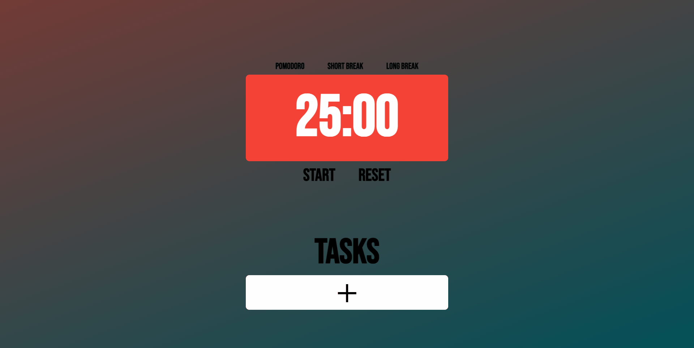

# Pomodoro

Version 0.0.4

This project was generated with [Angular CLI](https://github.com/angular/angular-cli) version 16.2.1.

<!-- [Live Demo](https://pomodoro-xi-five.vercel.app/) -->
<a href="https://pomodoro-xi-five.vercel.app/" target="_blank">Live Demo</a>

## Table of Content
* [About](#about)
* [How to use](#how-to-use)
* [Deployment and testing](#deployment-and-testing)
* [Version history](#version-history)
* [Todo](#todo)

##   About

A Pomodoro web app created by Austin Choi for the Codédex JavaScript course final project using Angular and TypeScript

### Version information

#### 0.0.4

In this version I updated the UI to make it look a little more cleaner. I lowered the opacity of the div surrounding the timer and added in a zen mode with an ultra-minimalist aesthetic to allow the user to relax while using the application.

Please refer to [todo](#todo) for a list of current issues I will be taking care of

##   How to use

To use this click on which timer you want to use
> Pomodoro
>
> Short Break
>
> Long Break

After that click on "Start"

You can pause a timer by clicking on "Pause"

If you want to reset a timer, first pause the timer then click on "Reset"

You can also add tasks you want to accomplish during the pomodoro session by clicking on the add new task button then filling out the form to add a task!

Tasks will update when the timer is complete!

##   Deployment and testing

### Development server

Run `ng serve` for a dev server. Navigate to `http://localhost:4200/`. The application will automatically reload if you change any of the source files.

### Code scaffolding

Run `ng generate component component-name` to generate a new component. You can also use `ng generate directive|pipe|service|class|guard|interface|enum|module`.

### Build

Run `ng build` to build the project. The build artifacts will be stored in the `dist/` directory.

### Running unit tests

Run `ng test` to execute the unit tests via [Karma](https://karma-runner.github.io).

### Running end-to-end tests

Run `ng e2e` to execute the end-to-end tests via a platform of your choice. To use this command, you need to first add a package that implements end-to-end testing capabilities.

### Further help

To get more help on the Angular CLI use `ng help` or go check out the [Angular CLI Overview and Command Reference](https://angular.io/cli) page.

##   Version history
v0.0.1 Initial Version

v0.0.2 Fixing Timer

v0.0.3 Task Update

v0.0.4 Zen Mode

##   Todo
- Add more features to the tasks such as:
  - task editing
  - task rearrangement
  - task removal
  - Task urgency level
  - Display more task information
- Make tasks more detailed by adding:
  - Goals
  - Start Date
  - End Date
  - Subtasks
- Backend tasks to implement:
  - Add user authentication (possibly using NextAuth.js)
  - Deploy express.js API
- Future wants but not needs:
  - Group pomodoros
  - Team accounts
  - Task assignments
  - Other task management features and tools
    - Kanban board
    - Other task scheduling systems
  - User data analysis
    - Track user habits and trends
    - How many pomodoros on average a user does for tasks
    - How many pomodoros on average a user does for tasks by urgency
    - How often a user reopens a task or deletes a task
    - Other analytics
